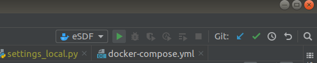

**Базової технологічна платформа «eServices Development Framework»** 


**Суть:**  
ІС SDF призначена для спрощення процедури отримання послуг, що надаються державними органами виконавчої влади та органами місцевого самоврядування, шляхом трансформації процедури їх надання в електронну форму. 
реалізації набору типових функцій та інтеграцій, необхідних органам влади в процесі надання електронних послуг.
  
**Технічне рішення:** https://docs.google.com/document/d/1IAz4fzYvZDzvVZ9VqEB7AMEtLj6ca5mYm-axkxf9P-Q/edit   


**Технічні вимоги до системи:**   
- Docker
- Docker compose  


**Інсталяція Docker**
- Debian/Ubuntu (*протестовано на Ubuntu 18.04, x86*):
  
  - Docker CE: 
    - Виконайте `sudo apt-get update 
  && sudo apt-get install -y apt-transport-https ca-certificates curl gnupg-agent software-properties-common 
  && curl -fsSL https://download.docker.com/linux/ubuntu/gpg | sudo apt-key add -
  && sudo add-apt-repository "deb [arch=amd64] https://download.docker.com/linux/ubuntu $(lsb_release -cs) stable" 
  && sudo apt-get update
  && sudo apt-get install docker-ce docker-ce-cli containerd.io
  && newgrp docker
  && sudo usermod -aG docker $USER
  && echo "Перевірка встановлення: $(docker version)"` 
  
    - Перезавантажте систему
  
  - Docker compose: `
  sudo curl -L "https://github.com/docker/compose/releases/download/1.24.0/docker-compose-$(uname -s)-$(uname -m)" -o /usr/local/bin/docker-compose
  && sudo chmod +x /usr/local/bin/docker-compose
  && sudo ln -s /usr/local/bin/docker-compose /usr/bin/docker-compose
  && echo "Перевірка встановлення: $(docker-compose --version)"`
  
- Інші дистрибутиви Linux:
  - Docker CE: https://docs.docker.com/install/linux/docker-ce/ubuntu/
  - Docker Compose: https://docs.docker.com/compose/install/

- Windows:
  - Docker Desktop: https://docs.docker.com/docker-for-windows/install/
  - Docker Compose: https://docs.docker.com/compose/install/
  
- MacOS:
  - Docker Desktop: https://docs.docker.com/docker-for-mac/install/
  - Docker Compose: https://docs.docker.com/compose/install/
  
**Інсталяція системи:**  
- Клонувати собі репозиторій: `git clone https://gitlab.com/tapasproject/esdf.git`
- Скопіювати **`./web/docker_django/system/settings/settings_local_sample.py`** в **`./web/docker_django/system/settings/settings_local.py`**. Поміняти параметри БД та пошти на свої локальні 
- Скопіювати **`./.env.base`** у **`./.env`**
- Додати підтримку Django

- Позначити відповідну структуру проекту:  
  
- Налаштувати PyCharm для работи з Docker та створити конфігурацію запуску:
  - ;
  - Services: `nginx, gunicorn, db, rabbitmq, celeryworker, celerybeat, redis`
- Зупиніть усі процеси, що використовують 80, 8081, 5433, 15673 або інші, вказані в `.env` файлі, порти
- Якщо у вас запущені інші Docker Compose кластери, зупиніть їх, виконанням `docker-compose stop` у корінних директоріях проектів
- Додати `127.0.0.1       sign-widget-test.eu.iit.com.ua` до файлу *hosts*
   - Windows: `C:\Windows\System32\drivers\etc\hosts`
   - Linux: `/etc/hosts`
   - MacOS: `/etc/hosts`
- Зібрати образ esdf_django_image: `docker-compose build`
- Запустити кластер:
   - `docker-compose up -d`
   - Або, використовуючи можливості PyCharm: 
     
- Завантажити міграції: `docker-compose exec gunicorn python manage.py migrate`
- Підвантажити фікстури (демо дані):  
    `docker-compose exec gunicorn python /utils/load_fixtures.py`
  
  
**Налаштування Pycharm:**   
  **Налаштувати віддалений інтерпретатор Python**  
- 1.  
- 2.   


  **Прописати для Python Console**
  ```` 
import sys; import sys;  print('Python %s on %s' % (sys.version, sys.platform))
sys.path.extend([WORKING_DIR_AND_PYTHON_PATHS])

basedir = "/app/docker_django"
sys.path.insert(0, basedir)
sys.path.append(os.path.abspath(os.path.join(basedir, "modules")))
sys.path.append(os.path.abspath(os.path.join(basedir, "applications")))
sys.path.append(os.path.abspath(os.path.join(basedir, "eservices")))
sys.path.append(os.path.abspath(os.path.join(basedir, "system")))
````
  
    
**У Django console:**
````
import sys 
import os

import django

print('Python %s on %s' % (sys.version, sys.platform))
print('Django %s' % django.get_version())

basedir = "/app/docker_django"
sys.path.insert(0, basedir)
sys.path.append(os.path.abspath(os.path.join(basedir, "modules")))
sys.path.append(os.path.abspath(os.path.join(basedir, "applications")))
sys.path.append(os.path.abspath(os.path.join(basedir, "eservices")))
sys.path.append(os.path.abspath(os.path.join(basedir, "system")))

os.environ.setdefault('DJANGO_SETTINGS_MODULE', 'system.settings.base')

if  'setup' in dir(django):
    django.setup()
sys.path.extend([WORKING_DIR_AND_PYTHON_PATHS])
import django_manage_shell
django_manage_shell.run("/app")
````
    

 
